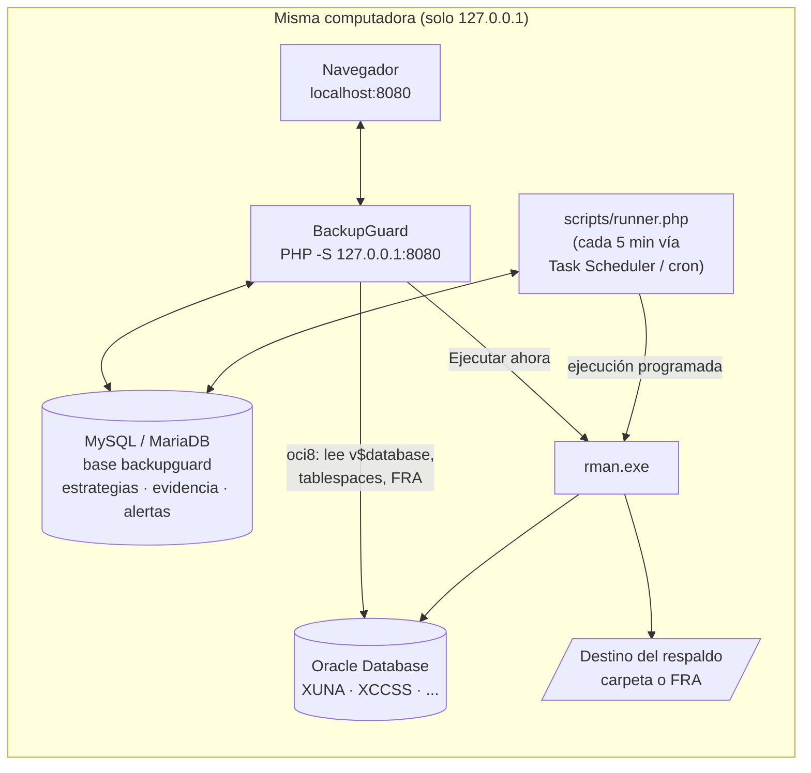
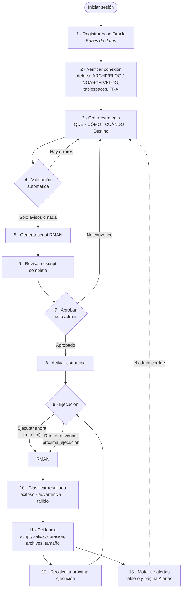
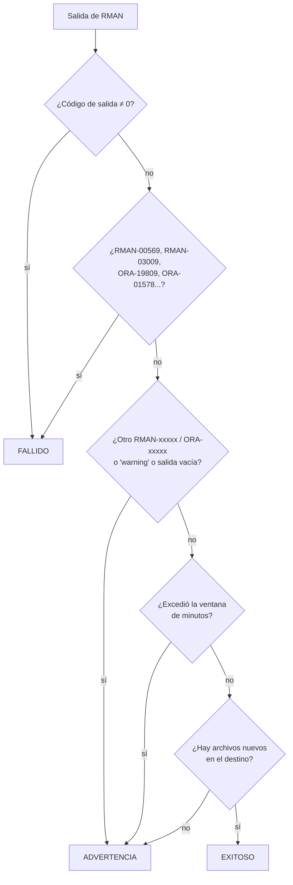
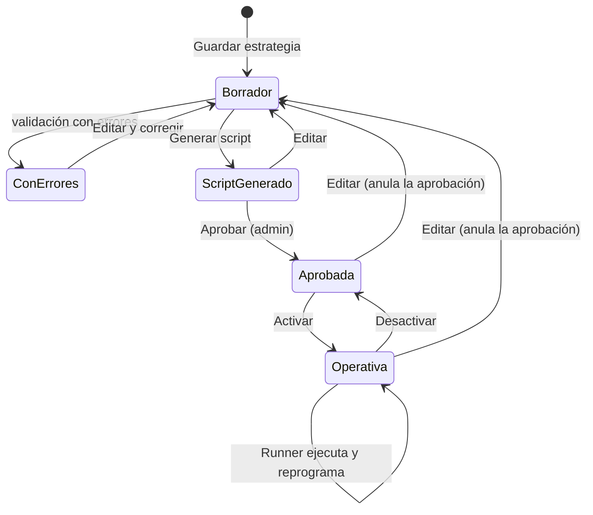
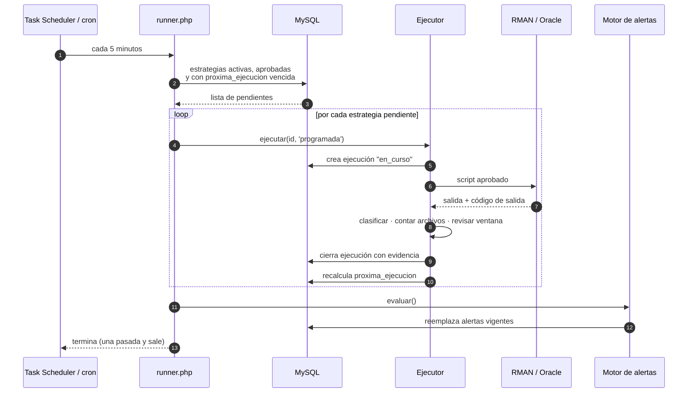

# Guía de uso — flujo completo de BackupGuard

Curso EIF402 — Administración de Bases de Datos · Universidad Nacional · II ciclo 2026

Esta guía empieza donde termina [`instalacion-local.md`](instalacion-local.md):
`iniciar.bat` está corriendo y `http://localhost:8080` responde. Explica cómo se
opera la herramienta de punta a punta y sirve como base para la exposición.

> Los diagramas están en **Mermaid**. Se ven renderizados en GitHub y en VS Code
> (vista previa de Markdown con la extensión *Markdown Preview Mermaid Support*).
> Debajo del diagrama principal hay una versión en texto plano por si el
> proyector o el visor no lo renderiza.

---

## 1. La idea en una frase

> BackupGuard no ejecuta scripts RMAN: **administra estrategias de respaldo**.
> Una estrategia se declara (QUÉ · CÓMO · CUÁNDO), se valida, se traduce a un
> script RMAN auditable, un administrador la aprueba, se ejecuta sola en su
> horario, deja evidencia y el sistema vigila continuamente que siga protegiendo.

El riesgo baja no porque se ejecute RMAN, sino porque el respaldo **deja de
depender de que alguien se acuerde**, y porque el sistema **avisa cuando algo
dejó de cumplirse**.

---

## 2. Arquitectura en una mirada



| Pieza | Qué guarda o hace |
|---|---|
| **MySQL** (`backupguard`) | Las *decisiones* y la *evidencia*: usuarios, bases registradas, estrategias, ejecuciones, alertas, bitácora |
| **Oracle** | Lo que se respalda. BackupGuard **solo lee** de ella (modo de archivado, tablespaces, FRA); nunca la modifica |
| **RMAN** | El motor que hace el respaldo, con el script que generó y aprobó BackupGuard |
| **Runner** | El "reloj": revisa qué estrategias vencieron y las ejecuta sin intervención humana |

**Modo simulación** (`modo_simulacion => true` en `includes/config.php`): todo
funciona igual salvo que no se llama a `rman.exe`; se genera una salida con el
mismo formato y queda marcada como **simulado**. Clasificación, evidencia,
alertas y reprogramación son el mismo código que en modo real.

---

## 3. El flujo completo



Versión en texto:

```
 Login
   │
   ▼
 [1] Registrar base ──► [2] Verificar (lee ARCHIVELOG, tablespaces, FRA)
                              │
                              ▼
 [3] Crear estrategia:  QUÉ  ·  CÓMO  ·  CUÁNDO  ·  Destino
                              │
                              ▼
 [4] Validación ──── error ───► volver a [3]
        │ ok / avisos
        ▼
 [5] Generar script RMAN ──► [6] Revisarlo ──► [7] Aprobar (admin)
                                                    │
                                                    ▼
                                            [8] Activar
                                                    │
                    ┌───────────────────────────────┤
                    ▼                               ▼
          "Ejecutar ahora" (manual)       Runner (programada, sola)
                    └───────────────┬───────────────┘
                                    ▼
             [10] Clasificar ──► [11] Evidencia ──► [12] Próxima fecha
                                    │
                                    ▼
                          [13] Alertas preventivas ──► el admin corrige
```

---

## 4. Paso a paso en la interfaz

La barra superior tiene cinco secciones: **Tablero · Estrategias · Bases de
datos · Historial · Alertas**, más el usuario conectado, su rol y **Salir**.

### Paso 0 — Iniciar sesión

`http://localhost:8080` redirige a `login.php`. Si todavía no existe ningún
usuario, entrá primero a `crear-admin.php` (se cierra sola cuando ya hay un
admin).

Lo que se ve depende del **rol**:

| Rol | Puede | No puede |
|---|---|---|
| `admin` | Todo: registrar bases, aprobar, ejecutar, eliminar | — |
| `operador` | Crear/editar estrategias, generar script, activar, atender alertas | Aprobar ni ejecutar |
| `auditor` | Ver tablero, historial, evidencia y alertas | Modificar nada |

> **Mensaje para la exposición:** quien diseña la estrategia no es
> necesariamente quien la aprueba. Esa separación de funciones es un control
> preventivo en sí mismo.

### Paso 1 — Registrar la base Oracle (`Bases de datos`)

Formulario **Registrar una base**:

| Campo | Ejemplo | Nota |
|---|---|---|
| Nombre | `XUNA` | Identificador dentro de la herramienta |
| Ambiente | Pruebas / Desarrollo / **Producción** | Producción dispara una advertencia al validar |
| Alias TNS | `XEPDB1` | O bien Host + Puerto (`1521`) + Service name |
| Usuario / Contraseña | `bgbackup` | La contraseña se guarda cifrada con AES-256-GCM |
| Conectar AS SYSDBA | ☐ | Marcar si el usuario necesita conexión privilegiada |

Botón **Registrar base**.

### Paso 2 — Verificar la base

En la tabla **Bases registradas**, botón **Verificar**. Con `oci8` habilitado,
aparece el panel **Contexto leído de …**:

- **Modo de archivado** leído de `v$database` → insignia ARCHIVELOG / NOARCHIVELOG.
- Estado (`open_mode`) y DBID.
- Uso de la **Fast Recovery Area** (advertencia si supera el 85%, porque un
  respaldo puede fallar con `ORA-19809`).
- Cantidad de tablespaces y datafiles disponibles para incluir en una estrategia.

Según el modo:

- **NOARCHIVELOG** → *Advertencia*: "Las posibilidades de recuperación son más
  limitadas. Revise la estrategia…"
- **ARCHIVELOG** → *Recomendación*: "Considere incorporar el respaldo periódico
  de los archived redo logs…"

> BackupGuard **nunca** cambia el modo de archivado. Informa; la decisión es del
> administrador.

Sin `oci8` aparece un aviso amarillo y se puede seguir trabajando en modo
simulación.

### Paso 3 — Crear la estrategia (`Tablero → Nueva estrategia` o `Estrategias`)

El formulario está dividido en los bloques del modelo **QUÉ · CÓMO · CUÁNDO**:

```mermaid
flowchart LR
    subgraph G[Información general]
        g1[Nombre · Base · Responsable]
        g2[Prioridad alta/media/baja<br/>+ criterio]
        g3[Estado activa/inactiva]
    end
    subgraph Q[QUÉ respaldar]
        q1[Alcance: base completa /<br/>tablespaces / datafiles]
        q2[Control file · SPFILE]
        q3[Archived redo logs<br/>+ DELETE INPUT]
    end
    subgraph C[CÓMO respaldar]
        c1[Completo / Incremental 0 /<br/>Incremental 1 dif. o acum.]
        c2[Compresión · Canales 1–8]
        c3[Retención días · Ventana min.]
        c4[Verificar respaldo]
    end
    subgraph W[CUÁNDO respaldar]
        w1[Fecha de inicio · Hora]
        w2[Única / Diaria /<br/>Semanal días / Mensual día]
    end
    subgraph D[Destino]
        d1[Carpeta o vacío = FRA]
    end
    G --> Q --> C --> W --> D
```



Botón **Guardar estrategia** → lleva a la pantalla de detalle.

**Cómo se traduce cada opción a RMAN:**

| Opción en pantalla | Instrucción RMAN generada |
|---|---|
| Base completa / Tablespaces / Datafiles | `BACKUP ... DATABASE` / `TABLESPACE a, b` / `DATAFILE 4` |
| Incluir control file | `INCLUDE CURRENT CONTROLFILE` |
| Incluir SPFILE | `BACKUP SPFILE` |
| Incluir archived redo logs (+ borrar) | `PLUS ARCHIVELOG [DELETE INPUT]` |
| Completo | `BACKUP AS BACKUPSET` |
| Incremental nivel 0 | `BACKUP INCREMENTAL LEVEL 0` |
| Incremental nivel 1 diferencial | `BACKUP INCREMENTAL LEVEL 1` |
| Incremental nivel 1 acumulativo | `BACKUP INCREMENTAL LEVEL 1 CUMULATIVE` |
| Comprimir | `AS COMPRESSED BACKUPSET` |
| Canales en paralelo = n | n × `ALLOCATE CHANNEL` |
| Retención (días) | `CONFIGURE RETENTION POLICY` + `DELETE OBSOLETE` |
| Verificar el respaldo | `VALIDATE BACKUPSET ALL` + `RESTORE DATABASE VALIDATE` |
| Carpeta de destino | Cláusula `FORMAT`; vacío = Fast Recovery Area |

### Paso 4 — Validación (pantalla de detalle, panel superior)

Se evalúa automáticamente cada vez que se abre la estrategia. Cuatro niveles:

| Nivel | Color | ¿Bloquea? | Ejemplos reales |
|---|---|---|---|
| **Error** | rojo | **Sí**, no deja generar el script | Archivelogs en base NOARCHIVELOG · Incremental 1 sin modalidad · Alcance "tablespaces" sin objetos · Estrategia activa sin fecha/hora · Semanal sin días · `DELETE INPUT` sin incluir archivelogs |
| **Advertencia** | ámbar | No | Base en NOARCHIVELOG · Base de PRODUCCIÓN · Modo de archivado sin verificar · Incremental sobre NOARCHIVELOG |
| **Recomendación** | verde | No | Base ARCHIVELOG que no respalda sus archived redo logs |
| **Información** | gris | No | Sin destino → irá a la FRA · Modalidad ignorada en tipo no incremental 1 |

> Solo los errores bloquean. Todo lo demás informa y deja la decisión en manos
> del administrador.

### Paso 5 y 6 — Generar y revisar el script (panel **Script RMAN**)

- Botón **Generar script** (deshabilitado si hay errores).
- Se muestra **completo** el script, con la leyenda "Este es exactamente el
  conjunto de instrucciones que se enviará a RMAN".
- El panel **Qué · Cómo · Cuándo** explica en lenguaje natural qué hace cada
  línea.

Ejemplo real generado para *XUNA – Respaldo completo semanal*:

```
BACKUP AS COMPRESSED BACKUPSET DATABASE INCLUDE CURRENT CONTROLFILE
  TAG 'BG_XUNARESPALDOCOMPL_COMPLE'
  FORMAT 'C:\BackupGuard_Sim\XUNA\bg_%d_%T_%s_%p.bkp'
  PLUS ARCHIVELOG;
```

### Paso 7 — Aprobar (solo `admin`)

Botón **Aprobar este script**. Queda registrado quién y cuándo aprobó (panel
**Estado de la automatización** → Script: *Aprobado por X el …*).

> **Regla clave:** si alguien **edita** la estrategia, la aprobación se anula y
> el script se borra. Nunca se ejecuta un script que ya no corresponde a la
> configuración vigente.

### Paso 8 — Activar

Botón **Activar** (arriba a la derecha). El panel de estado confirma:

- Activa + aprobada → ✅ "La estrategia se ejecutará sola en la próxima fecha programada…"
- Activa sin aprobar → ⚠️ "…no se ejecutará automáticamente."

### Paso 9 — Ejecutar

Dos caminos que terminan en el mismo motor (`Ejecutor`):

| Camino | Cómo | Origen registrado |
|---|---|---|
| **Manual** | Botón **Ejecutar ahora** (pide confirmación) | `manual` |
| **Automático** | El runner la toma sola cuando vence `proxima_ejecucion` | `programada` |
| **Demostración de fallo** | Botón **Simular un fallo** — genera una ejecución fallida sin tocar la base | `manual` |

### Paso 10 — Clasificación del resultado

BackupGuard **no asume éxito porque RMAN terminó**: revisa la salida completa.



### Paso 11 — Evidencia (`Ver evidencia →` / `ejecucion-detalle.php`)

Cada ejecución guarda:

| Dato | Para qué sirve |
|---|---|
| Inicio, fin, duración | Comprobar que corrió y dentro de la ventana |
| Origen (manual / programada) y quién | Trazabilidad |
| Resultado + insignia *simulado* si aplica | Estado verificable |
| Código de salida y errores extraídos | Diagnóstico |
| **Salida completa de RMAN** | Prueba textual de lo ocurrido |
| **Script exacto ejecutado** | Qué se corrió realmente, aunque luego se edite la estrategia |
| Ubicación, archivos generados, tamaño | La existencia del archivo es evidencia |

El **Historial** lista todas las ejecuciones y permite filtrar por estrategia.

### Paso 12 — Reprogramación automática

Después de cada ejecución se recalcula `proxima_ejecucion` según la frecuencia
(por ejemplo, semanal domingo 23:00 → el domingo siguiente). Se ve en el
**Tablero → Próximas ejecuciones**.

### Paso 13 — Alertas preventivas (`Tablero` y `Alertas`)

El motor se re-evalúa en cada visita al tablero y en cada pasada del runner.

| Código | Qué detecta | Severidad |
|---|---|---|
| `EJECUCION_FALLIDA` | La última ejecución de una estrategia falló (últimos 7 días) | 🔴 crítica |
| `NO_EJECUTADO` | Debía correr hace más de 2 h y no corrió | 🔴 crítica |
| `SIN_RESPALDO_RECIENTE` | Prioridad alta sin respaldo en 48 h | 🔴 crítica |
| `NOARCHIVELOG` | Base en NOARCHIVELOG | 🟠 advertencia |
| `SIN_PROGRAMACION` | Estrategia activa sin próxima ejecución calculable | 🟠 advertencia |
| `SIN_APROBACION` | Estrategia activa sin script aprobado | 🟠 advertencia |
| `INACTIVA_PRODUCCION` | Estrategia inactiva sobre base de producción | 🟠 advertencia |
| `SIN_ESTRATEGIA` | Base registrada sin ninguna estrategia | 🟠 advertencia |
| `ARCHIVELOGS_FUERA` | Base ARCHIVELOG cuya estrategia no los respalda | 🟢 recomendación |
| `SIN_CHEQUEO` | Más de 7 días sin verificar la base | ⚪ información |

Botón **Atender**: la alerta no vuelve a aparecer mientras la condición siga
igual; si la condición cambia (por ejemplo, un fallo nuevo), se levanta una
alerta nueva. Si la estrategia vuelve a correr con éxito,
`EJECUCION_FALLIDA` desaparece sola.

---

## 5. Ciclo de vida de una estrategia



Solo el estado **Operativa** (activa + aprobada + con fecha) es tomado por el
runner.

---

## 6. La automatización: qué hace el runner



Comandos útiles desde la carpeta del proyecto:

```
php scripts/runner.php --dry-run   # muestra qué está pendiente, no ejecuta
php scripts/runner.php             # ejecuta lo que corresponda
```

Salida típica:

```
[...] Ejecutando #1 "XUNA - Respaldo completo semanal" sobre XUNA...
[...]   → EXITOSO (0s) — evidencia #5
[...] Alertas vigentes: 6 (críticas 1, advertencias 4, recomendaciones 0).
```

---

## 7. Guion sugerido para la exposición (≈ 15 minutos)

Preparación previa: `iniciar.bat` corriendo, sesión iniciada como admin, las
bases **XUNA** (producción, ARCHIVELOG) y **XCCSS** (pruebas, NOARCHIVELOG) ya
registradas (ver [`simulacion-xuna-xccss.md`](simulacion-xuna-xccss.md)).

| # | Min. | Pantalla | Qué mostrar | Qué decir |
|---|---|---|---|---|
| 1 | 1 | — (diagrama §2) | Arquitectura local | "Corre donde está Oracle; nunca expuesta a internet porque guarda credenciales SYSDBA" |
| 2 | 1 | Tablero | Métricas, alertas, próximas ejecuciones | "Responde tres preguntas: qué está mal, qué se respaldó, qué viene" |
| 3 | 2 | Bases de datos | XUNA vs XCCSS, insignias de archivado | "La herramienta lee el modo de archivado; no lo cambia" |
| 4 | 3 | Nueva estrategia | Llenar QUÉ · CÓMO · CUÁNDO sobre XCCSS **marcando archived redo logs** | — |
| 5 | 1 | Detalle | Aparece **Error** rojo, botón Generar deshabilitado | "Regla dura: NOARCHIVELOG no genera archivelogs" |
| 6 | 1 | Editar | Quitar archivelogs, guardar | Queda solo la advertencia NOARCHIVELOG |
| 7 | 2 | Detalle | Generar script → leerlo → Aprobar | "Nada se ejecuta sin que un humano lo apruebe" |
| 8 | 1 | Detalle | Activar → Ejecutar ahora | Resultado exitoso + insignia *simulado* |
| 9 | 1 | Evidencia | Salida RMAN, script, archivos, tamaño | "No asumimos éxito: revisamos el log y los archivos" |
| 10 | 1 | Detalle | **Simular un fallo** → evidencia con `ORA-19809` | Tablero ahora con alerta crítica `EJECUCION_FALLIDA` |
| 11 | 1 | Terminal | `php scripts/runner.php --dry-run` y luego sin `--dry-run` | "Esto es lo que hace el Programador de tareas cada 5 minutos" |
| 12 | — | Tablero | Próxima ejecución recalculada | Cerrar con la frase del §1 |

> **Consejo para la demo en vivo:** programá una estrategia con fecha de hoy y
> hora a 2–3 minutos en el futuro; al correr el runner después de esa hora se ve
> cómo la toma sola, cambia el origen a `programada` y reprograma la siguiente.

---

## 8. Mensajes clave (para las diapositivas)

1. **Estrategia ≠ script.** Se administra la decisión; RMAN solo la ejecuta.
2. **Validar antes de generar.** Cuatro niveles de aviso; solo los errores bloquean.
3. **Transparencia.** El script se muestra completo antes de aprobarlo.
4. **Separación de funciones.** Operador diseña, admin aprueba, auditor revisa.
5. **Editar anula la aprobación.** Nunca corre un script desactualizado.
6. **No asumir éxito.** Se lee el log, se cuentan archivos, se revisa la ventana.
7. **Evidencia completa.** Script exacto + salida + tiempos + archivos.
8. **Vigilancia continua.** 10 reglas de alerta detectan cuándo la estrategia deja de proteger.
9. **Respeto por la base.** Solo lectura sobre Oracle; el modo de archivado lo decide el DBA.

---

## 9. Preguntas frecuentes (para la ronda de preguntas)

**¿Por qué no está en un hosting?**
No hay hosting gratuito con Oracle, y una herramienta con credenciales SYSDBA
que ejecuta RMAN expuesta en internet crearía un riesgo mayor que el que
pretende reducir. Por eso escucha solo en `127.0.0.1`.

**¿Qué pasa si la computadora está apagada a la hora programada?**
No corre. Mientras tanto, si pasaron más de 2 horas de la hora programada, el
tablero muestra la alerta crítica `NO_EJECUTADO`. Al volver a encenderse, el
runner la toma en su siguiente pasada (la fecha sigue vencida), la ejecuta y
calcula la próxima.

**¿Cómo se sabe que el respaldo sirve para recuperar?**
Con *Verificar el respaldo* activado, el script agrega `VALIDATE BACKUPSET ALL`
y `RESTORE DATABASE VALIDATE`: RMAN lee los respaldos y comprueba que se pueden
restaurar sin escribir nada en la base.

**¿Qué diferencia hay entre simulación y real?**
Solo la llamada a `rman.exe`. Todo lo demás (validación, script, aprobación,
clasificación, evidencia, alertas, reprogramación) es el mismo código.

**¿Dónde están las contraseñas de Oracle?**
Cifradas con AES-256-GCM en MySQL, con la `encryption_key` de `config.php`
(fuera de git). Las de usuarios de BackupGuard con `password_hash`.

**¿Queda registro de quién hizo qué?**
Sí, en la tabla `bitacora`: generar, aprobar, activar, desactivar, eliminar,
atender alertas.

**¿Por qué incremental sobre NOARCHIVELOG es solo advertencia y no error?**
Es técnicamente válido (con la base en MOUNT), pero solo permite recuperar al
momento exacto de un respaldo. La herramienta informa el riesgo y respeta la
decisión del administrador.

---

## 10. Glosario rápido

| Término | Significado |
|---|---|
| **RMAN** | Recovery Manager, la herramienta oficial de Oracle para respaldar y recuperar |
| **ARCHIVELOG** | Modo en que Oracle guarda los redo logs llenos; permite recuperación a un punto en el tiempo |
| **NOARCHIVELOG** | Los redo logs se sobrescriben; solo se recupera hasta el último respaldo completo |
| **Incremental nivel 0** | Copia completa que sirve de base para los nivel 1 |
| **Nivel 1 diferencial** | Bloques cambiados desde el último incremental (0 o 1) |
| **Nivel 1 acumulativo** | Bloques cambiados desde el último nivel 0 |
| **FRA** | Fast Recovery Area, zona de disco que Oracle administra para respaldos |
| **Ventana de respaldo** | Tiempo máximo aceptable para que termine; excederla degrada a *advertencia* |
| **Runner** | Proceso que ejecuta las estrategias vencidas; lo invoca el planificador del sistema |
| **Evidencia** | Registro verificable de una ejecución: script, salida, tiempos, archivos |

---

## Documentos relacionados

- [`instalacion-local.md`](instalacion-local.md) — cómo dejarlo corriendo
- [`simulacion-xuna-xccss.md`](simulacion-xuna-xccss.md) — datos de la demo y cómo se generaron
- [`manual-oracle-xuna-xccss.md`](manual-oracle-xuna-xccss.md) — pasar a Oracle real
- [`mapeo-requerimientos.md`](mapeo-requerimientos.md) — cada requerimiento del enunciado y dónde se resuelve
- [`informe-hallazgos.md`](informe-hallazgos.md) — resultados de la verificación
